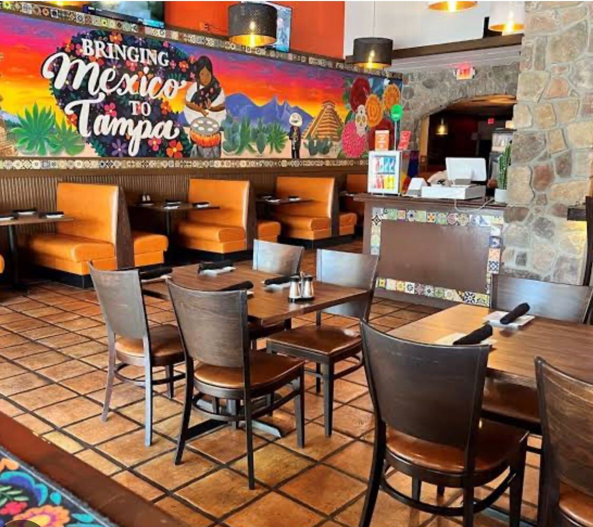

# Mexico Restaurant Rating

---

## Introduction
This data set is called the restaurant rating dataset which contains information about restaurants in mexico. A customer survey was carried out in this city in 2012 to collate information about each restaurant, their cuisines, information about their consumers and the preferences of the consumers.

## Problem statement
1.	What can you learn from the highest rated restaurants? Do consumer preferences have an effect on ratings?
2.	What are the consumer demographics? Does this indicate a bias in the data sample?
3.	Are there any demand & supply gaps that you can exploit in the market?
4.	If you were to invest in a restaurant, which characteristics would you be looking for?

## Skills/ concepts demonstrated:
The following Power BI features were incorporated:
- Data cleaning,
- New measure,
- New column,
- Merging,
- Filtering

