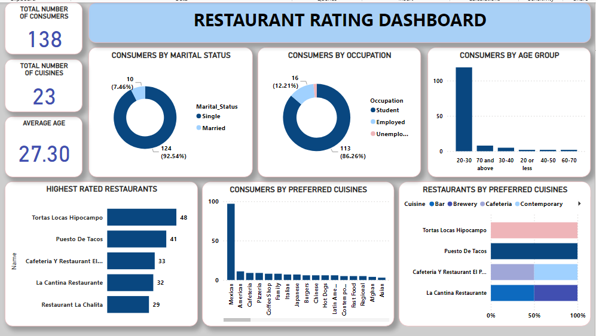

# Mexico Restaurant Rating

---

## Introduction
This data set is called the restaurant rating dataset which contains information about restaurants in mexico. A customer survey was carried out in this city in 2012 to collate information about each restaurant, their cuisines, information about their consumers and the preferences of the consumers.

## Problem statement
1.	What can you learn from the highest rated restaurants? Do consumer preferences have an effect on ratings?
2.	What are the consumer demographics? Does this indicate a bias in the data sample?
3.	Are there any demand & supply gaps that you can exploit in the market?
4.	If you were to invest in a restaurant, which characteristics would you be looking for?

## Skills/ concepts demonstrated:
The following Power BI features were incorporated:
- Data cleaning,
- New measure,
- New column,
- Merging,
- Filtering

## Visualization

The report consists of;
1.	Restaurant rating
2.	Consumer preferences
3.	Restaurant cuisines 
4.	Consumers
5.	Restaurants

You can see the Datasets here

Features:
My dashboard features include:
- Donut charts
- Stacked column charts
- Stacked bar chart
- 100% Stacked bar chart

## Analysis
### Restaurants in Mexico:
There are 127 restaurants, the restaurants have about 138 consumers and a total number of 23 cuisines and the average age of consumers is 27.30
Highest rated restaurants and consumer preferences:
Consumer preferences do not affect the ratings. Some of the top-rated restaurant, like; Tortas Locas Hipocampo, cafeteria Y restaurant El pacifico, La cantinan restaurante etc, does not serve the most preferred cuisine, which is Mexican.

### Consumer demographics and indication of biases:
There is bias in the data sample. The data might have come from reviews, and there could be bias in who leaves reviews. Younger, single people, and students might be more likely to leave online reviews compared to older adults or families. The data might have also been collected from a school area

### Demand & supply gaps that you can exploited:
From the analysis, some of the top-rated restaurants, like Tortas Locas Hipocampo, Cafeteria y Restaurant El Pacifico, and La Cantina Restaurante, do not serve the most preferred cuisine, which is Mexican. This is surprising because these restaurants are in Mexico, where Mexican food is likely to be the traditional choice.🤓

## Restaurant Rating Dashboard:

## Conclusion and Recommendation:
Focusing on a narrow demographic can limit business growth opportunities by not catering to a broader audience. Business decisions based only on this demographic might ignore the needs and preferences of other potential customer groups. 
Restaurants in Mexico should serve more Mexican food because it is in high demand and will likely earn them more sales. 
Based on this analysis, investing in a restaurant that appeals to 20 to 30-year-old singles and students could be a good opportunity. Focus on the right location, affordable and appealing menu options, a trendy ambiance, and a strong online and social media presence to attract and keep this target audience. Ensuring operational efficiency and actively responding to customer feedback will also be key to success. 😄

